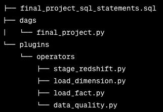

# Data-pipeline-Udacity

This project aims to build a robust and adaptable data pipeline with reusable tasks, enabling efficient monitoring and seamless backfilling. Ensuring data quality is crucial for accurate analyses on the data warehouse. Therefore, the pipeline includes tests that validate Sparkify's datasets for any inconsistencies or anomalies after the completion of ETL processes.

# Data

The source data is stored in S3 and requires processing in Sparkify's data warehouse located in Amazon Redshift. The source datasets comprise JSON logs containing user activity information within the application, along with JSON metadata describing the songs users listen to.

Here are the s3 links for datasets used in this project:

Log data: s3://udacity-dend/log_data Song data: s3://udacity-dend/song_data

# Structure

The project has the following structure:

 
 
 
-final_project_sql_statements.sql: SQL create table statements provided with the template.
 
-dags/final_project.py: Defines the main DAG, tasks, and links the tasks in the required order.
 
-plugins/operators/stage_redshift.py: Defines the StageToRedshiftOperator to copy JSON data from S3 to staging tables in the Redshift via the copy command.
 
-plugins/operators/load_dimension.py: Defines the LoadDimensionOperator to load a dimension table from staging table(s).
 
-plugins/operators/load_fact.py: Defines the LoadFactOperator to load the fact table from staging table(s).
 
-plugins/operators/data_quality.py: Defines the DataQualityOperator to run data quality checks on all tables passed as a parameter.
 
-plugins/operators/sql_queries.py: Contains SQL queries for the ETL pipeline (provided in the template).

# Configuration

This code uses python 3 and assumes that Apache Airflow is installed and configured.

Create a Redshift cluster.
Create a shell script such as set_connection.sh.
Make sure to add following two Airflow connections are provided in the shell script.
AWS credentials, named aws_credentials
Connection to AWS IAM User and Amazon Redshift.

# Automated Pipeline

Apache Airflow will estabish the following pipline for the project.

